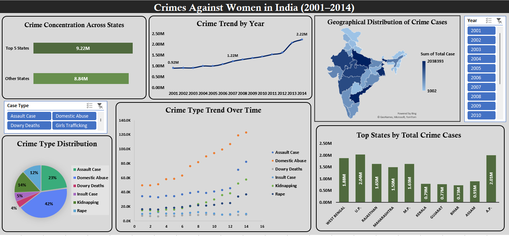

# CRIMES-AGAINST-WOMEN-IN-INDIA
## 📌 Project Overview

This project analyzes **Crimes Against Women in India between 2001 and 2014** using an interactive **Microsoft Excel dashboard**.The objective of this project is to transform raw government crime data into **clear, meaningful insights** that highlight trends, patterns, and regional differences in reported cases across India.
Through data analysis and visualization, this dashboard provides a **data-driven view of a critical social issue**.

---

## Project Goals

* Analyze yearly trends in reported crime cases
* Identify states with the highest crime reports
* Compare different crime categories affecting women
* Present insights through clear and interactive visualizations

## Dashboard Insights
Key findings from the analysis include:
* Reported crime cases increased significantly from *~0.92 million in 2001 to over 2.2 million in 2014*.
* Certain states consistently reported *higher crime counts*, indicating regional disparities.
* *Domestic violence, assault, and kidnapping cases* form a major portion of reported crimes.
* Data visualization helps reveal *patterns that are difficult to identify in raw datasets*.

## Tools & Techniques Used

* Microsoft Excel
* Data Cleaning
* Pivot Tables
* Data Analysis
* Dashboard Design
* Data Visualization

## Dashboard Features

* Year-wise crime trend analysis
* State-wise crime distribution
* Crime category comparison
* Top states by total reported cases
* Interactive dashboard for easy data exploration

## Skills Demonstrated
* Data Cleaning
* Data Analysis
* Dashboard Development
* Data Visualization
* Analytical Thinking

## Dashboard Preview

